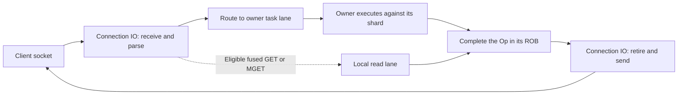

# Architecture

This document describes the implementation in `src/`. The central objects are
`Server` (process state and placement), `ThreadCtx` (one physical worker's
queues and local state), `Shard` (one owned part of the keyspace), `FlatStore`
(its table), `Client` (one connection), and `Op` (one issued command).

## Boot and thread modes

[main.cc](../src/main.cc) loads a configuration file, applies CLI overrides,
validates combinations, initializes hashing and the command registry, and
resolves placement. Snapshot/AOF validation and owner-side decoding finish
before listeners open. Boot failures stop initialization instead of exposing a
partially loaded keyspace.

[topology.h](../src/base/topology.h) intersects Linux CPU/cache topology with the
process affinity mask. [placement.h](../src/core/placement.h) assigns dense
thread IDs to CPUs and roles. When complete SMT pairs are available, selected
pairs must be complete and share a role. Shard count defaults to
`min(8 × initial executor count, 256)`; the router initially assigns shards
round-robin to executors.

| Mode | Mechanism | Entry points |
| --- | --- | --- |
| `2s` / `split` | IO threads receive, parse, route, retire, and send. Executor threads own shards and execute tasks. Each selected thread has one active role. | [main.cc](../src/main.cc), [io_loop.h](../src/core/io_loop.h), [ex_loop.h](../src/core/ex_loop.h) |
| `1s` / `fused` | Every selected thread has IO and executor loop objects. A rotation does connection work, bounded executor work, and reply work. Ordinary commands, including commands for self-owned shards, enter task lanes. | [genthread.cc](../src/core/genthread.cc), `FusedExLoop` in [ex_loop.h](../src/core/ex_loop.h) |

`1s` has no IO/executor ratio to change, so it rejects `--ratio`, `--flip-auto 1`,
and runtime `FLIP`. Both modes retain cross-thread owner dispatch. The optional
local-read lane is active only in `1s` with `x-overlap 0`. The other accepted
study schedules interleave work inside these two architectures; they are
described in [CONFIGURATION.md](CONFIGURATION.md#study-options).

## Ownership and routing

[shard.h](../src/core/shard.h) defines the hash-bucket router and shard state.
Hashing selects a bucket, the bucket selects a shard, and the server's published
owner map selects its current executor. A `FlatStore` is a physical ownership
unit: moving only part of one store to another writer is rejected.

Only the current owner mutates a shard's keyspace. Tasks check ownership and
forward stale routes through owner channels. A migration changes routing,
thread shard lists, and owner publications at a quiescent boundary; it does not
rehash or copy the shard's dataset.

Ownership includes every pointer into per-owner state. In particular,
`Server::transfer_shard_quiesced` and `transfer_bucket_range_quiesced` call
`adopt_read_local_retire_sink` before publishing the new owner. The sink's
retirement context and block-cache pointer therefore change inside the same
critical section. Later executor refreshes rebind other loop-local services;
they are not a substitute for this ownership-edge rebind.
See [server.h](../src/core/server.h) and [read_local.h](../src/core/read_local.h).

## Command and reply path

1. [conn.h](../src/net/conn.h) owns the receive buffer and connection state.
   [resp.h](../src/net/resp.h) parses command arguments as slices into that
   buffer. [commands.cc](../src/cmd/commands.cc) builds the case-insensitive
   registry from each command family's `CommandSpec` table. Flags and key
   metadata select routing, ACL checks, blocking, scripting, and scatter paths.
2. The IO loop reserves an `Op` in the connection's reorder buffer and publishes
   a `Task` to the owner. [op.h](../src/exec/op.h) holds arguments, execution
   state, and reply storage; [thread.h](../src/core/thread.h) defines the task
   and channel relationships. Full queues apply backpressure.
3. [masked_queue.h](../src/exec/masked_queue.h) supplies one consumer-owned task
   allocation partitioned into private SPSC producer lanes. Each lane publishes
   initialized slots with release/acquire ordering. Its geometry changes only
   after all claimed tasks retire during a quiescent role change. Completion,
   borrowed-value release, and client-transfer channels use
   [exqueue.h](../src/exec/exqueue.h).
4. The executor runs the handler on its shard, records any persistence and
   notification work, and publishes completion. Readiness masks and wakeups
   prompt IO to inspect completed operations. Parking paths also check actual
   queues; notification hints are not the sole evidence of pending work.
5. [rob.h](../src/net/rob.h) retires completed replies in issue order, even if
   owners finish out of order. [wb.h](../src/net/wb.h) stages reply bytes and
   iovecs and handles partial sends. IO owns socket submission and completion.

The default [uring.h](../src/net/uring.h) uses a ring per worker, including
executor wakeups. With `net-io epoll`, [epoll.h](../src/net/epoll.h) handles
network readiness and tagged eventfd mailboxes replace cross-ring messages.
[tls.cc](../src/net/tls.cc) owns OpenSSL state and attempts kernel TLS where
possible, with a userspace fallback. TCP listeners use IPv4 and `SO_REUSEPORT`;
[unix_listener.h](../src/net/unix_listener.h) owns the optional Unix socket.

## Storage and reclamation

[flatstore.h](../src/store/flatstore.h) is an open-addressed table with 64-bit
slots containing a pointer, hash tag, and tombstone bit. Normal incremental
rehashing uses current and old tables; lookups inspect both and migration moves
slot words. [kvobj.h](../src/store/kvobj.h) stores a small header, optional key
length and expiry fields, key bytes, and an inline value, integer, or external
pointer. Small string values embed in the object's allocation.

[typeval.h](../src/store/typeval.h) defines compact collection storage and
per-type backing objects. Command-family files own expanded representations,
mutations, accounting, and serialization hooks:

| Family | Source |
| --- | --- |
| Strings and general key operations | [t_string.cc](../src/cmd/t_string.cc) |
| Hashes | [t_hash.cc](../src/cmd/t_hash.cc), [t_hash_ttl.cc](../src/cmd/t_hash_ttl.cc) |
| Lists | [t_list.cc](../src/cmd/t_list.cc) |
| Sets | [t_set.cc](../src/cmd/t_set.cc) |
| Sorted sets and geospatial operations | [t_zset.cc](../src/cmd/t_zset.cc), [t_zset_ops.cc](../src/cmd/t_zset_ops.cc), [geo.cc](../src/cmd/geo.cc) |
| Streams and consumer groups | [t_stream.cc](../src/cmd/t_stream.cc), [t_stream_groups.cc](../src/cmd/t_stream_groups.cc) |

Local foreign readers decode
strings only; collection internals remain owner-side. Expiration uses lazy
checks and bounded owner-side attention to key and hash-field deadlines.
[store_ttl.h](../src/store/store_ttl.h) distinguishes a reserved deadline slot
from a live TTL. [t_hash_ttl.cc](../src/cmd/t_hash_ttl.cc) implements hash-field
expiration. [eviction.h](../src/store/eviction.h) names the policies; store code
does sampling and eviction against each shard's share of `maxmemory`.

In the ordinary unarmed path, the owner can overwrite eligible string storage
in place. Arming local reads selects immutable published string replacement in
the default build. Old objects and detached tables enter an owner-private retire
ring. Threads publish quiescence once per fused rotation, after consuming their
captured foreign pointers. A sealed batch can be reclaimed only after all active
participants have passed its retirement epoch; parked participants hold no such
pointers. This is quiescent-state-based reclamation (QSBR), not per-read
enter/leave registration. See [read_local.h](../src/core/read_local.h) and
[read_local_reclaim.h](../src/store/read_local_reclaim.h).

[kv_block_cache.h](../src/store/kv_block_cache.h) reuses eligible blocks only
after the grace period. Its allocation and free lists are owner-private.
Borrowed reply buffers have a separate lifetime: the store's borrow registry
retains a value until send completion or cancellation, and IO routes its release
back to the owner. `zc-min` controls this copy-avoidance threshold. It means
avoiding an application reply copy, not a promise of a kernel zero-copy send.
Local-read replies copy their data before the rotation ends and retain no foreign
store pointer in socket work.

## Ordering and atomicity

Reply order and execution visibility are separate mechanisms. The per-connection
ROB has a 64-operation window and allocates `Op` storage in chunks of eight.
`dispatch_id == flush_id` is its quiescence test. Ordered retirement also keeps
argument slices alive until their last consumer finishes. Receive buffers and
connection transfers respect those lifetimes.

[xshard.cc](../src/cmd/xshard.cc) includes
[scatter_engine.inc](../src/cmd/scatter_engine.inc),
[xshard_commands.inc](../src/cmd/xshard_commands.inc), and
[atomics_glue.inc](../src/cmd/atomics_glue.inc). They classify each command's
keys, prepare arena-backed scatter state, group work by shard and owner, and
assemble one final reply. Read/probe and mutation phases differ by command;
owner-to-owner follow-up tasks preserve the single-writer rule. A same-shard
shortcut avoids a distributed group where the command permits it. The IO-owned
[ScatterArenaPool](../src/cmd/xshard.h) recycles state after retirement.

With `atomic 1`, grouped mutations install candidates on participating owners
while their shared commit epoch remains undecided. Owner-private `AtomicEntry`
records retain displaced values and reference the group's decision words. One
published group ticket makes its installed effects logically visible together.
Read cuts name a committed epoch; owner-side resolution chooses a version at
that cut and accounts for the originating connection's program order. Published
read floors retain versions until every relevant reader has finished. Physical
collapse is later owner work. See [atomic_mvcc.h](../src/store/atomic_mvcc.h),
[flatstore_atomic.inc](../src/store/flatstore_atomic.inc), and the commit/read-floor
machinery in [server.h](../src/core/server.h).

`atomic 0` leaves ordinary multi-shard mutation waves without that group-wide
visibility guarantee. It does not remove the mechanism: `EXEC` and staged
cross-shard scripts force admission when they require a group. A read fanout can
hold a common cut even with the public atomic switch off.

[multi.inc](../src/cmd/multi.inc) owns transaction queuing, WATCH state,
execution, and aggregate replies. A transaction fragment encountering an older
undecided unit from the same connection parks before execution; it must not
begin a handler and discover its ordering dependency midway through it.
The version resolver repairs same-connection ordering without imposing a total
order on unrelated clients. Conflicting writes can replace a client's earlier
value; this is distinct from returning its own stale version.

[scripting.cc](../src/cmd/scripting.cc) embeds Lua and enforces declared-key and
instruction-limit rules; [functions.cc](../src/cmd/functions.cc) manages function
libraries. Cross-shard scripts pin declared keys, read a common cut into a private
workbench, run Lua, validate, and apply through owner tasks. Reservations force
intervening writes to leave detectable version history. Script conflict retries
and staging limits are derived in `Server`. [blocking.inc](../src/cmd/blocking.inc)
registers waits with shard owners while IO keeps the connection's response pending.

## Local reads

Admission, outstanding-write tracking, and demotion are in
[io_loop.h](../src/core/io_loop.h), [rob.h](../src/net/rob.h), and
[read_local.h](../src/core/read_local.h). Execution is in
[ex_loop.h](../src/core/ex_loop.h). Only eligible GET/MGET commands enter this
lane. Connection state, outstanding overlapping writes, broad owner routes,
notification requirements, and capacity can send them to ordinary owner tasks.
The write-history sidecar is armed on demand, not allocated for every connection.

If a later write overlaps unresolved local reads, the parser first demotes the
affected reads and their transitive key-overlap set into owner queues in program
order. It reserves queue capacity before publishing that change. Conservative
write sets demote conservatively; unrelated precise reads may remain local.
Completed replies still retire through the same ROB.

The reader synchronization claim is deliberately narrow. **Ordinary
nonstructural immutable replacements publish only their own slot to readers.**
They do not change a shard-wide validation sequence. A local GET captures a
key-checked immutable object and validates `probe_sequence`, the table-topology
word. Structural moves and atomic physical exchanges bracket changes to that
word; an interfering change makes the active captured GET path decline to the
owner instead of recapturing in a loop. QSBR makes the captured object's lifetime
safe even if the slot has since changed.

An atomic candidate can be physically present before it is logically visible.
[foreign_read_safety.h](../src/store/foreign_read_safety.h) therefore publishes
per-key unsafe references before that state can be observed. Foreign readers
probe counting fingerprint cells instead of traversing owner MVCC records.
Collisions can produce conservative fallback. Unenumerable changes poison the
whole shard's filter. References remain until abort restoration or committed
cleanup makes raw reads safe. Same-owner group/script scope publication also
uses a short table guard to close a probe-versus-publication race.

MGET copies a private aggregate reply before accepting its window. For up to
128 keys it brackets the copy with **every queried filter-cell epoch**, while
each individual probe validates topology. Larger MGETs instead compare table
generations across touched shards. Stable misses produce nil elements; expired
values or unsafe keys force owner execution. The active implementation permits
two complete attempts: one retry, then fallback. This conflicts with an absolute
no-reader-retry claim and is recorded in [FINDINGS](FINDINGS.md#reader-contract).
It is not an unbounded retry loop. No broad claim that every read is immune to
every write or control-plane pause follows from this lane.

## Persistence and side effects

[snapshot.cc](../src/snapshot/snapshot.cc) prepares tables, closes new atomic
group admission and drains outstanding apply work, freezes owners, establishes
a common time/commit cut, and marks tables before capture. BGSAVE resumes normal
execution during capture; SAVE keeps execution paused through completion.
Owners serialize pre-images before mutating unvisited snapshot values and emit
bounded chunks through the hooks in [format.h](../src/snapshot/format.h).
One IO owner writes, syncs, and renames the completed file.

[aof.cc](../src/persist/aof.cc) records logical per-shard streams in checksummed
binary frames, with one IO writer, group-commit dependencies, and recovery
validation. Rewriting produces a snapshot base and incremental logs selected by
a manifest. [aof_stream_owner.h](../src/persist/aof_stream_owner.h) prevents
physical control records from interleaving inside a large record. Reply
eligibility also observes the AOF policy's required write/durable frontiers.
`net-io` selects uring or syscall file operations. These persistence formats are
independent of the Redis value codec in [serialize.cc](../src/cmd/serialize.cc).

[pubsub.inc](../src/core/pubsub.inc) owns IO-side subscription and delivery work.
[notify.inc](../src/cmd/notify.inc) connects owner mutations to notifications,
tracking invalidations, and save-schedule mutation counts. The command registry
selects observer-enabled handlers when those facilities need them.
[tracking.cc](../src/cmd/tracking.cc), [climon.cc](../src/cmd/climon.cc), and
[acl.cc](../src/cmd/acl.cc) implement client tracking, client administration and
monitoring, and authorization respectively.

## Runtime rebalancing

The continuous balancer and the role controller have different jobs:

- `lb 1` enables key-demand sampling, client census, and movement while retaining
  the current IO/executor counts. [weighted_lb.h](../src/core/weighted_lb.h)
  partitions sampled demand while enforcing count balance; its policy derives
  sampling rates, jitter bands, move caps, and cooldowns. The controller in
  [server.h](../src/core/server.h) requires sustained evidence and coordinates
  owner or connection drains before moving work.
- `FLIP` changes the role split of existing physical threads in `2s`.
  [flipctl.cc](../src/core/flipctl.cc), enabled by `flip-auto 1`, invokes the same
  actuator after observing workload fingerprints and capacity/cost evidence.
  [flip_policy.h](../src/core/flip_policy.h) supplies the policy calculations.
  Fingerprints sample whole parse passes; enqueue-age sampling is armed during
  a maneuver and removed at its settled baseline. Automatic workload shifts do
  not restart an active maneuver; a forced diagnostic trigger can do so.

The FLIP actuator spans `server.h`, `io_loop.h`, and `ex_loop.h`. It drains
dispatch and outstanding work, prepares listeners and connection transfers,
commits and installs those transfers, changes shard owners and roles under
quiescence, and installs executor queue geometry before resuming dispatch.
Precommit failures can roll back; after connection commit the installation must
finish. Pinned services such as the AOF writer and Unix listener constrain which
threads can change roles. SMT siblings move together. Fused mode retains load
balancing but has no role-split actuator.

## Layout and code boundaries

The current source asserts these byte sizes: `Op` 336, `Client` 1984,
`ThreadCtx` 1408, `Shard` 1440, `FlatStore` 944, `Rob<64>` 192,
`AtomicEntry` 144, and `Config` **528**. The last differs from the older 624-byte
context. These assertions constrain hot-object layout; optional state often
lives behind owner-managed sidecars.

Many mechanisms are header-defined for specialization. The `.inc` files are
textually included implementations, not separate translation units. In
particular, `flatstore_atomic.inc` supplies members inside `FlatStore`, and
`xshard.cc` includes several command-execution mechanisms. The
[directory map](../src/README.md) names each boundary; the [Makefile](../Makefile)
is the authoritative list of compiled translation units.
